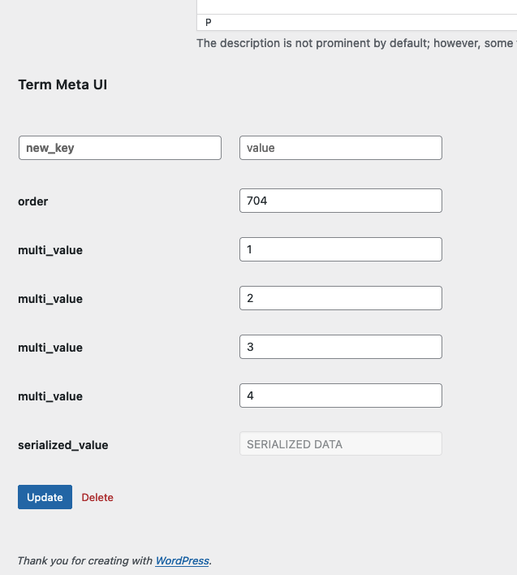

# term-meta-ui

WordPress plugin. Provides a user interface for reading and writing term meta data. If you've used `wp-admin/options.php` to view or edit options, this works similarly for taxonomy term meta values.

- Uses the core term meta database table & `add_term_meta`,`delete_term_meta` API functions
- Handles multi-valued meta fields

## Screenshot

This screenshot shows the bottom of `wp-admin/term.php` where a Term Meta UI section is added.

